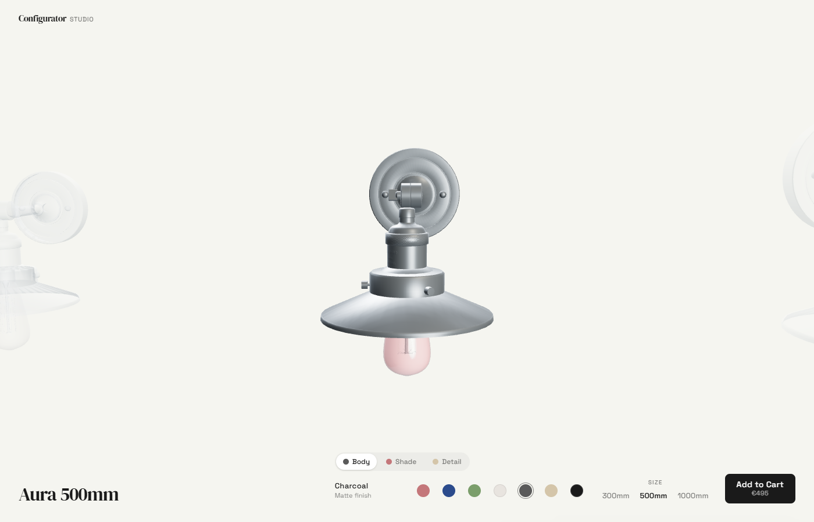
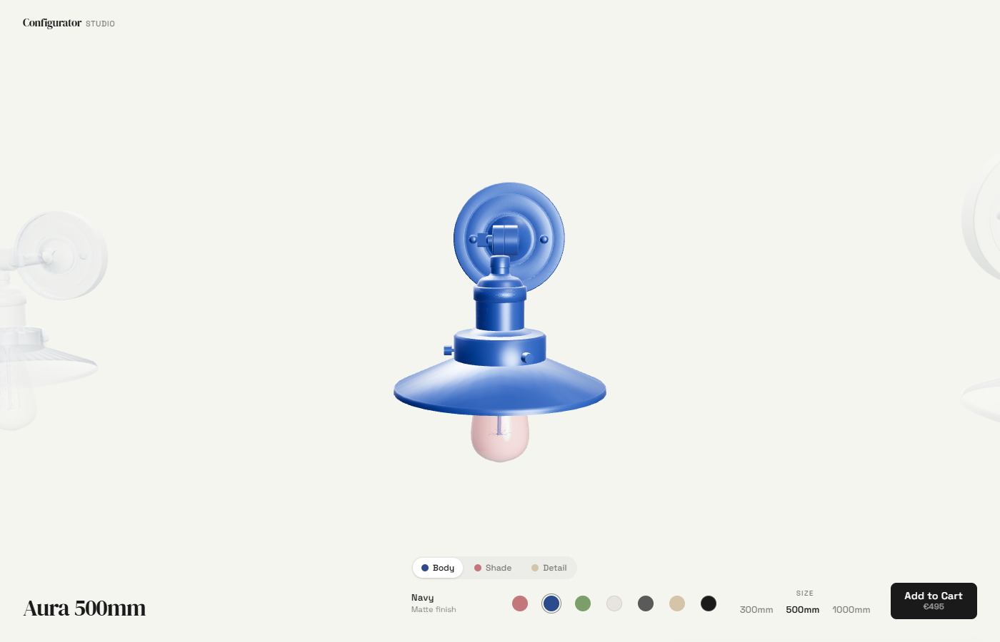
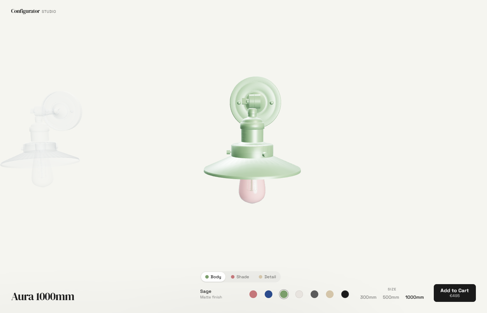
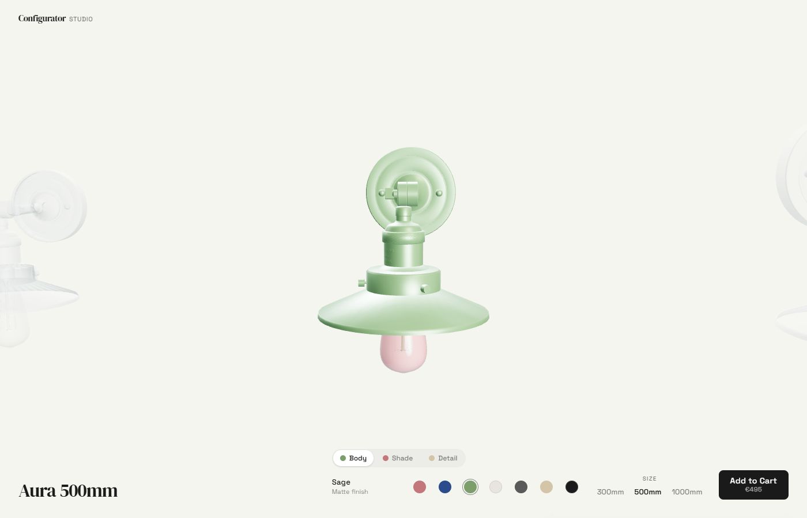

# 3D Product Configurator

Interactive 3D product configurator with real-time color, material, and size customization. Built with React Three Fiber.



## Features

- **Real-time 3D rendering** - GLB model with studio lighting, contact shadows, and smooth animations
- **Dynamic color tinting** - Per-part color customization (body, shade, accent) with matte and metallic finishes
- **Size carousel** - Horizontal carousel with drag navigation, momentum physics, and ghost transitions between sizes
- **Manual orbit** - Touch/mouse spin and tilt with clamped rotation
- **Live pricing** - Dynamic price calculation with finish surcharges
- **Add to Cart** - Shopify-ready cart payload with line item properties
- **Responsive design** - Full-viewport 3D canvas, adapts from mobile to desktop
- **WCAG AA accessible** - Keyboard navigation, ARIA labels, skip links, screen reader support
- **Error boundaries** - Graceful fallbacks for WebGL failures and loading timeouts
- **Loading states** - Branded splash screen with progress bar

## Screenshots

| Color customization | Size selection |
|---|---|
|  |  |
|  |  |

## Tech Stack

| Layer | Technology |
|-------|-----------|
| 3D Engine | React Three Fiber + @react-three/drei |
| UI Framework | React 18 + TypeScript |
| State Management | Zustand |
| Styling | Tailwind CSS v4 |
| Build Tool | Vite 6 |
| Linting | Biome |
| Testing | Vitest (unit) + Playwright (e2e) |
| Error Tracking | Sentry |

## Quick Start

```bash
git clone https://github.com/voyagi/3d-product-configurator.git
cd 3d-product-configurator
npm install
npm run dev
```

Open [http://localhost:5173](http://localhost:5173) in your browser.

## Scripts

```bash
npm run dev        # Start development server
npm run build      # TypeScript check + production build
npm run test       # Run unit tests
npm run lint       # Lint with Biome
npm run preview    # Preview production build
```

## Architecture

```
src/
  components/
    canvas/          # R3F 3D scene, GLB model, lighting
    ui/              # Overlay controls (color picker, size selector, cart)
  constants/         # Color palette, size definitions
  store/             # Zustand state (colors, size, active part)
  lib/               # Analytics, utilities
```

The configurator renders a full-viewport R3F canvas with DOM overlay controls. State flows through a Zustand store shared between the 3D scene and UI components. Color changes apply real-time material tinting to individual mesh groups in the GLB model.

### Shopify Integration

Designed as a Shopify-embeddable widget via Theme App Extension. The configurator builds a complete cart payload with line item properties (selected colors, size, finish type, pricing) ready for the Shopify Ajax Cart API. Runs standalone for demo purposes.

## License

MIT
